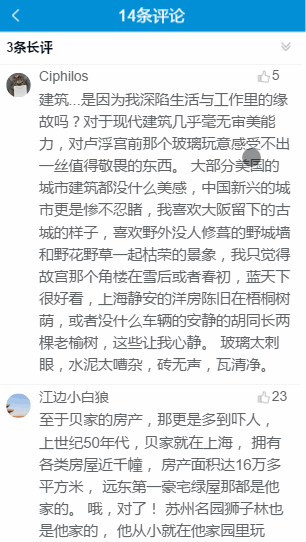

# Vue-News

> 一个基于vue全家桶开发的仿知乎日报单页应用

> 项目github地址:[https://github.com/biaodigit/vue-news](https://github.com/biaodigit/vue-news)

> 如果觉得做得还不错 , 或者项目源码对您有帮助 , 希望您小抬右手到右上角点一个star , 您的支持是作者长期更新维护的动力^_^

## 最新公告
> 毕设已完成，对这个项目开始重构 —————— 2017.12.17

## 声明
>『知乎』是 知乎. Inc 的注册商标。本软件与其代码非由知乎创作或维护。软件中所包含的信息与内容皆违反版权与知乎用户协议。本项目所有文字图片等稿件内容均由[知乎](https://www.zhihu.com)提供，获取与共享之行为或有侵犯知乎权益的嫌疑。若被告知需停止共享与使用，本人会及时删除整个项目。请您了解相关情况，并遵守知乎协议。

## 项目起源
从二月份开始学习[vue](https://cn.vuejs.org/)学习了一个半月后去跟着[滴滴黄轶老师](https://github.com/ustbhuangyi)学习他的[Vue.js高仿饿了么外卖App课程](http://coding.imooc.com/class/74.html),做完后收获颇丰，对vue的实际项目应用有了基本的了解,同时也学习到了移动端布局，例如flex,1px边框,正方形背景图等等,做完整个课程后决定自己再去做一个小东西去加深巩固vue知识树,因此又花了数天去阅读[vuex文档](https://vuex.vuejs.org/zh-cn/),[vue-router文档](https://router.vuejs.org/zh-cn/),[axios](https://github.com/mzabriskie/axios),以及饿了么前端团队开发的[mint-ui](http://mint-ui.github.io/#!/zh-cn),最后在[博哥](https://github.com/cccyb)的推荐下选择了仿知乎日报作为独立demo的prototype,原因吗很简单，标准的单页面应用，没有太多复杂的交互效果，以及现成的[api接口](https://github.com/izzyleung/ZhihuDailyPurify/wiki/%E7%9F%A5%E4%B9%8E%E6%97%A5%E6%8A%A5-API-%E5%88%86%E6%9E%90),然后,就开工啦！

## 技术栈

> vue2+vue-router+vuex+axios+better-scroll+mint-ui+stylus

## demo预览地址

[在线地址](http://lwdvue.cn/#/)

PC端建议在chrome浏览器的移动端模式下浏览

## 功能

- [x] 首页
- [x] 首页滑动图
- [x] 图片懒加载
- [x] 侧边栏过渡动画
- [x] 侧边栏主题列表上下滑动
- [x] 首页下拉刷新
- [x] 首页上拉加载
- [x] 收藏页
- [x] 新闻详情页
- [x] 收藏新闻
- [x] 点赞
- [x] 评论页面
- [x] 评论收起/展开
- [x] 主题页面
- [x] 查看主题主编列表
- [x] 查看主题主编个人主页

## 截图
### 首页


### 新闻详情页


### 评论页


### 收藏页


### 主题页


### 主题主编列表页


### 主题主编个人主页


## 存在的bug
- [ ] 下拉刷新时会出现空白
- [ ] 收藏路由过渡动画生硬,且动画只执行了一半
- [ ] 新闻详情页过渡动画出现加载数据量大回退卡顿【此交互已取消,日后或采用weex解决】
- [x] ~~加载下一篇新闻若加载到已加载新闻数组id最后一篇则无法加载下一篇~~
- [x] ~~侧边栏显示滑动穿透~~

## Todo
- [ ] 流畅的路由过渡动画
- [ ] 手势滑动显示/隐藏侧边栏
- [x] ~~加载下一篇新闻~~
- [ ] 消息页面
- [ ] 设置页面
- [x] ~~夜间模式~~
- [ ] 下拉加载上一篇
- [ ] 上拉加载下一篇
- [ ] vuex重构
- [ ] stylus重构
- [ ] 替换mint-ui组件
- [ ] localStorage
- [ ] 主题页面头部背景图片
- [ ] 手势滑动切换路由页面
- [ ] 解决上述bug

## 总结
### 知乎接口跨域问题(在此感谢[yatecssss](http://www.yatessss.com/2016/07/08/%E4%BD%BF%E7%94%A8vue%E5%AE%8C%E6%88%90%E7%9F%A5%E4%B9%8E%E6%97%A5%E6%8A%A5web%E7%89%88.html)前辈做出的贡献)
调用知乎API时遇到了跨域问题，但是知乎的接口好像不支持jsonp，谷歌一波发现可以使用vue-cli自带的config的proxyTable文件配置进行解决，配置非常简单：

```js
proxyTable: {
 '/api': {
    target: 'http://news-at.zhihu.com',
    changeOrigin: true,
    pathRewrite: {
      '^/api': '/api/4'
    }
  }
}
```
此时请求`api/xxx`将会代理成`http://news-at.zhihu.com/api/4/xxx`
这样就不会有跨域问题了，当然这只适用于开发环境。

### 图片防盗链问题
知乎API返回的数据中的图片都是存储在知乎服务器上的url地址，直接请求会返回403，所以需要进行一些处理，这里我采用了[yatessss](https://github.com/yatessss)前辈在[使用vue完成知乎日报web版](http://www.yatessss.com/2016/07/08/%E4%BD%BF%E7%94%A8vue%E5%AE%8C%E6%88%90%E7%9F%A5%E4%B9%8E%E6%97%A5%E6%8A%A5web%E7%89%88.html)的解决方案，使用[Images.weserv.nl](https://images.weserv.nl)进行缓存图片，并在需要使用图片url的地方进行相应的替换。

```js
 attachImageUrl(srcUrl) {
   if(srcUrl !== undefined){
      return srcUrl.replace(/http\w{0,1}:\/\/p/g,'https://images.weserv.nl/?url=p')
   }
 }
```
或
```js
 attachImageUrl: function(body) {
    return body.replace(/src="http\w{0,1}:\/\//g, 'src="https://images.weserv.nl/?url=')
  }
```

## 参考
> 感谢[izzyleung](https://github.com/izzyleung)前辈整理的 [知乎日报API分析](https://github.com/izzyleung/ZhihuDailyPurify/wiki/%E7%9F%A5%E4%B9%8E%E6%97%A5%E6%8A%A5-API-%E5%88%86%E6%9E%90)

> 感谢[yatecssss](https://github.com/yatessss) 前辈的[使用vue完成知乎日报web版](http://www.yatessss.com/2016/07/08/%E4%BD%BF%E7%94%A8vue%E5%AE%8C%E6%88%90%E7%9F%A5%E4%B9%8E%E6%97%A5%E6%8A%A5web%E7%89%88.html)总结

> 感谢[鹏神](https://github.com/HunterPen),[康哥](https://github.com/ZWkang),[陈老板](https://github.com/cccyb),自然哥在开发过程中给予的帮助,心怀感恩,铭记于心！


